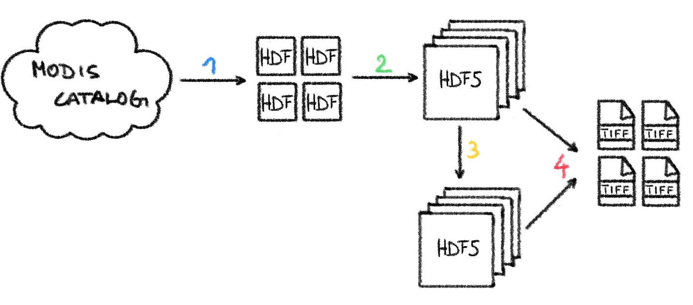

# MODAPE

## Overview

The **MOD**IS **A**ssimilation and **P**rocessing **E**ngine combines a state-of-the-art whittaker smoother, implemented as fast C-extension through Cython, with a HDF5 based processing chain optimized for MODIS data.

The implementation of the Whittaker filter includes a V-curve based optimization of the smoothing parameter, which allows a pixel by pixel variation in the degree of smoothing applied, directly derived from the pixel’s timeseries. In addition, MODAPE implements expectile smoothing to estimate a smoothly varying envelope of the input signal.

Most users will want to use the out-of-the-box processing chain, which features pre-tuned parameters for running the smoother and command line executables, that enable the user to run the entire processing chain with minimal input from the command line.

!!! Note
      While there are no restrictions on which MODIS data can be downloaded, the full processing chain is (currently) only implemented for
      MOD/MYD 11&13 products (NDVI, EVI, LST).

The chain breaks down into 4 separate steps, each executable with a dedicated command line script, that handle everything from downloading raw MODIS data, to filtering the data and exporting it as GeoTIFF for downstream analysis and visualization:

<br>

<figure>
  
  <br>
  <figcaption>MODIS processing chain in MODAPE</figcaption>
</figure>

<ol>
<li style='color: #2688FB;'>
  <span style='color:black;'>
  <code>modis_download</code>
  <br> Query and download MODIS data to local storage (requires <a href="https://urs.earthdata.nasa.gov/" target="_blank">Earthdata credentials</a>)
  </span>
</li>
<li style='color: #6FDD82;'>
  <span style='color:black;'>
  <code>modis_collect</code>
  <br> Collect raw NASA HDF files into raw HDF5 file(s)</a>
  </span>
</li>
</li>
<li style='color: #FED138;'>
  <span style='color:black;'>
  <code>modis_smooth</code>
  <br> Run Whittaker smoother on raw HDF5 file(s)</a>
  </span>
</li>
<li style='color: #FC4B5A;'>
  <span style='color:black;'>
  <code>modis_window</code>
  <br> Export data from raw/smooth HDF5 file(s) as GeoTIFF</a>
  </span>
</li>
</ol>


## Installation

MODAPE builds on [GDAL](https://gdal.org/) and **expects working python bindings**. Both can be a bit tricky to set up correctly, but here's a couple of tips for installing it poperly depending on the system:

- **Ubuntu**: Check out [UbuntuGIS](https://wiki.ubuntu.com/UbuntuGIS)
- **Windows**: Chris Gohlke has an amazing collection of unofficial binary wheels, one of them is [GDAL for various version of python](https://www.lfd.uci.edu/~gohlke/pythonlibs/#gdal)

### Installation with python/pip

_Note: It's recommended to use a virtual environment_

#### from [PyPI](https://pypi.org/project/modape/)

```
pip3 install modape
```

#### from [GitHub](https://github.com/WFP-VAM/modape.git)

```
git clone https://github.com/WFP-VAM/modape.git
cd modape
pip3 install .
```

or with `setup.py`:

```
git clone https://github.com/WFP-VAM/modape.git
cd modape
python3 setup.py install
```

### Installation with Docker

```
git clone https://github.com/WFP-VAM/modape.git
cd modape
docker build -t modape .

# check if it's working
docker run --rm -it modape modape_version
```

## Quick guide to naming convention

!!! Note
    Since MODAPE was developed for WFP VAM's operational needs, it _heavily_ uses an established naming convention for different variables etc.

The naming for both raw and smooth HDF5 files will be constructed from:

- MODIS product type
- tile index (if applicable)
- temporal interpolation code (for smooth files)
- MODIS collection number
- VAM parameter code

### VAM parameter codes

 Parameter code | Reference
:---: | :---:
**VIM** | MODIS Normalized Difference Vegetation Index (NDVI)
**VEM** | MODIS Enhanced Vegetation Index (EVI)
**TDA** | MODIS Aqua Daytime Land Surface Temperature
**TNA** | MODIS Aqua Nighttime Land Surface Temperature
**TDT** | MODIS Terra Daytime Land Surface Temperature
**TNT** | MODIS Terra Nighttime Land Surface Temperature

### Temporal interpolation codes

Code | Reference
:---: | :---:
**TXN** | Native temporal resolution (no interpolation performed)
**TXD** | 10-day timestep (dekads)
**TXP** | 5-day timestep (pentads)
**TXC** | Custom interpolation (as defined by user)

### Examples

#### Raw HDF5 file

!!! Example
    - `MOD13A2.h20v08.006.VIM.h5`: this is an example for 1km MODIS NDVI, collection 6, for the tile h20v08 from the Terra satellite
    - `MXD13A2.h20v08.006.VIM.h5`: if both Aqua and Terra get interleaved, the product code changes to `MXD`
    - `MXD13C1.006.VIM.h5`: if the product is global, the filename does not include a tile index

#### Smooth HDF5 file

The filename for a smooth HDF5 file is directly derived from the raw input, so all elements of the raw file will be adopted. The only thing changing is the added information of the temporal interpolation.

!!! Example
    - `MXD13A2.h20v08.006.txn.VIM.h5`: smooth version of the rawfile above, without temporal interpolation (so in native timestep)
    - `MXD13A2.h20v08.006.txd.VIM.h5`: same as above, just with temporal interpolation performed to 10-day (dekad) timestep

#### Exported GeoTIFFs

The naming for the exported GeoTIFFs is put together from the region code (supplied by the user - if not, the default is _reg_), VAM code and the timestamp (either in julian format or dekads/pentads if applicable).

!!! Note
    The filenames don't contain any information about the product or tile, so GeoTIFFs from different files can end up having the same name and be easily overwritten. Caution is advised!


!!! Example
    - `regvim2020001.tif`: basic example for an exported NDVI image for either a raw HDF5 file, or a smooth HDF5 file with no or custom temporal interpolation

    - `regvim2020d1.tif`: If the temporal interpolation is dekad, the timestamps are converted to dekads (this behavior can be prevented with a flag in the executable)
